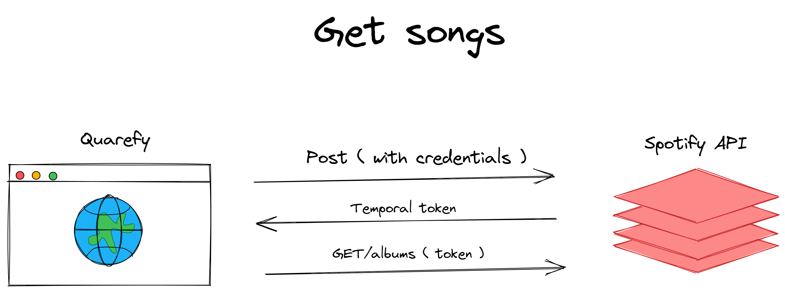

# Documentation

## Dev commants
* ``npm install``
* ``npm run dev``

## Server commants
* ``npm install``
* ``npm run build``
* Publish directory ``./dist``

## Config the environment variables
* Create a ``.env.local`` file and add yours credentials.
* Is important that the variables start with VITE_
* Credentials for spotify API:
  * These credentials are fake, is only an example.
```
  VITE_CLIENT_ID = '54554861237832153521'
  VITE_CLIENT_SECRET = '4664846ssxzxxzc78'
  VITE_API = 'API of spotify'
```


## Git metodology 

Explicar la metodologia de git con graficos y todo

## Overview

## Built With
